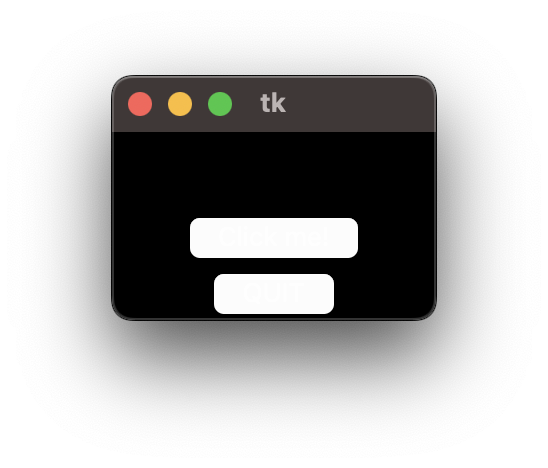
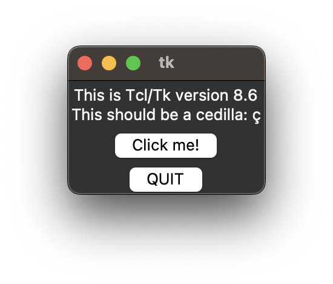

# TK interface on a Mac Silicon M2

Run this command to test [tkinter](https://docs.python.org/3/library/tkinter.html).

```shell
python3 -m tkinter -c "tkinter._test()"
```

On an M2 you'll probably see this



Fortunately this [article](https://www.andrlik.org/dispatches/til-tkinter-on-m2-mac/) provides a guide to fix this. Just
enter the commands listed below. It assumes the presence of [Homebrew](https://brew.sh/) on your machine. It will install the [asdf](https://asdf-vm.com/) version manager and installs the specified version of [Python](https://devguide.python.org/versions/) with tk bundled.

- brew install asdf
- brew install tcl-tk
- asdf uninstall python 3.11.5
- asdf reshim python
- PYTHON_CONFIGURE_OPTS="--with-tcltk-includes='\$(pkg-config tk --cflags)' --with-tcltk-libs='\$(pkg-config tk --libs)'"
- asdf install python 3.11.5
- asdf shell python 3.11.5 (per shell session)
  or
- asdf global python latest (more permanent, see `~/.tool-versions`)

When succesful, test again with `python3 -m tkinter -c "tkinter._test()"` and hopefully this will be the result

