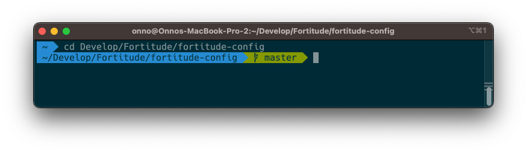
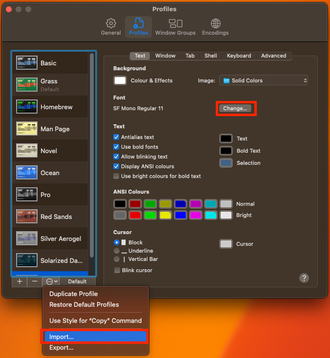
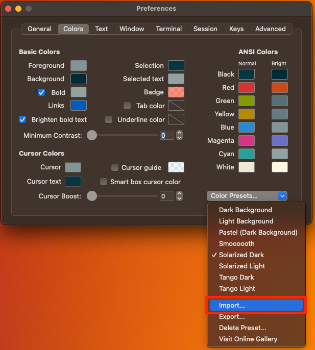
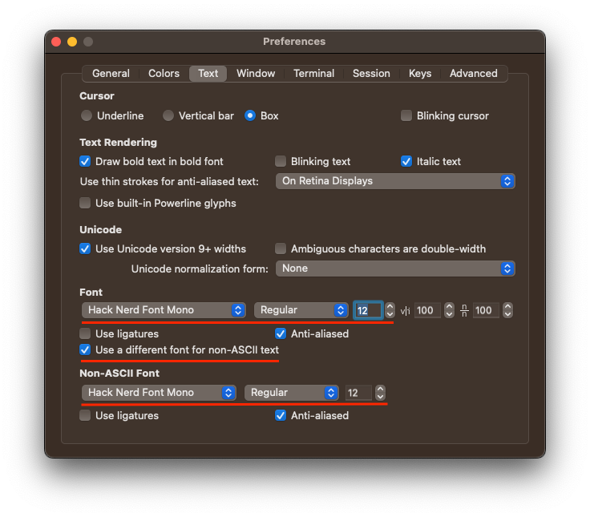

# Terminal Makeover

## DX

To have a better developer experience and a smile on your face once you open up a command line terminal, a few things can be done to spicing it up. Follow the steps below and you might end up with something like



The theme used in this HOW-TO is agnoster, the font Hack Nerd Font and the color scheme Solarized Dark.

## Oh My Zsh

On a Mac the default shell is `zsh`. You can verify this by opening up a terminal and issue the following command:

```shell
echo $SHELL
```

and the output should be something along the lines of `/bin/zsh`.

To expand the `zsh` functionality Oh My Zsh (http://ohmyz.sh/) offers a nice solution. To install it:

```shell
sh -c "$(curl -fsSL https://raw.githubusercontent.com/ohmyzsh/ohmyzsh/master/tools/install.sh)"
```

If the installation is successful open up .zshrc (in your user folder) and change the theme to agnoster to have an informative (git-)prompt:

```shell
ZSH_THEME=“agnoster”
```

and maybe activate the git-plugin to add some aliases

```shell
plugins=(git)
```

## Fonts

In order to make full use of the themes provided by Oh My Zsh some additional fonts may be required. Powerline (https://github.com/powerline/fonts) and Nerd Fonts (https://www.nerdfonts.com/font-downloads) offer a wide variety.

Download the fonts you like and install them using the Font Book app and ⌘O or just copy them.

```shell
cp *.ttf ~/Library/Fonts
```

## Colours

Next to fonts, colours also play an important role in the look and feel. The default dark blue colour on a black background make your eyes squint. Luckily they can be managed in schemes. Here are a few: https://github.com/mbadolato/iTerm2-Color-Schemes. Download the release (.zip) or clone the repository in order to store the files on your machine.

Then activate them in Terminal, iTerm or whatever your favourite command line platform is.

## Terminal

- Launch Terminal
- Type ⌘, (Command Comma)
- Click on Import from the bottom left pull-down menu
- Click on the terminal folder of your colour schemes location
- Select the .terminal profiles you would like to import
- Press Default to make every session using this scheme
- Click on Change… and choose a font/size

A screenshot to help you navigate…



## iTerm

- Launch iTerm 2 (http://www.iterm2.com/)
- Type ⌘i (Command I)
- Navigate to Colors tab
- Click on Color Presets
- Click on Import
- Click on the schemes folder of your colour schemes location
- Select the .itermcolors profiles you would like to import
- Click on Color Presets and choose a color scheme

Some screenshots to help you navigate…






## VS Code

- Launch VS Code (https://code.visualstudio.com/)
- Open Command Pallette (⌘⇧P)
- Type settings and select Preferences: Open User Settings (JSON)
- Add or edit below settings to the settings JSON file and save

```json
{
…
  "workbench.colorTheme": "Solarized Dark",
  "terminal.integrated.fontFamily": "Hack Nerd Font",
  "terminal.integrated.fontSize": 14,
  "terminal.integrated.lineHeight": 1.2,
…
}
```
