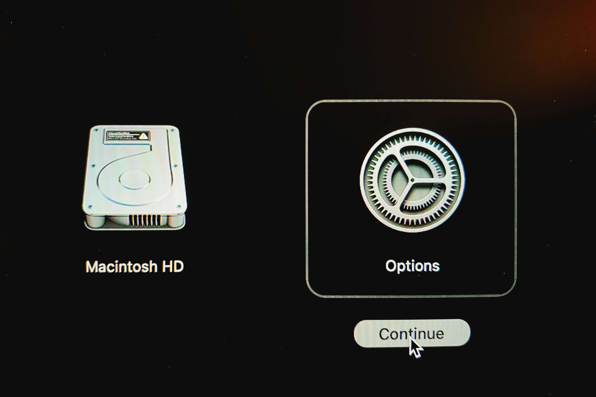
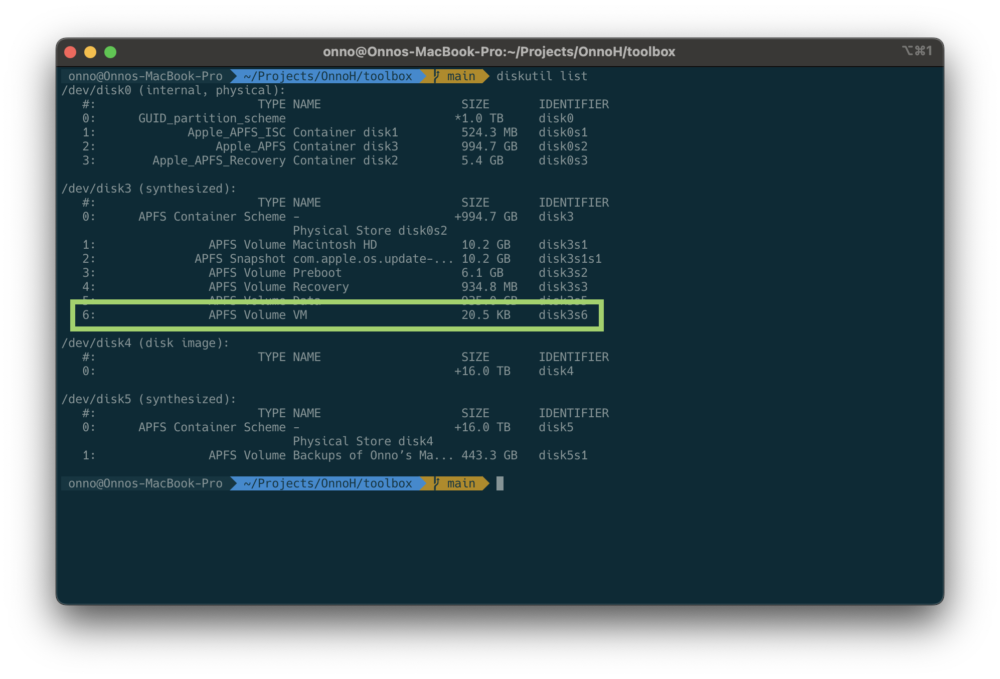

# Catch 22

https://www.merriam-webster.com/dictionary/catch-22

1. : a problematic situation for which the only solution is denied by a circumstance inherent in the problem or by a rule
the show-business catch-22—no work unless you have an agent, no agent unless you've worked
—Mary Murphy
also : the circumstance or rule that denies a solution
2.
    1. : an illogical, unreasonable, or senseless situation
    2. : a measure or policy whose effect is the opposite of what was intended
    3. : a situation presenting two equally undesirable alternatives
3. : a hidden difficulty or means of entrapment : CATCH

## What happened?

I wanted to start an adventure with machine learning. For that I had my eye on Meta's Llama 3 model. Without doing any reading upfront I wanted those LLMs downloaded to my MacBook.

Easy as pie. Just sign up and you get an e-mail message with the appropriate links. Use a `download.sh` script from the specified GitHub repo and run it.

When on 1GB fiber, this runs very smooth. Just paste the URL and press enter. A mistake as it turns out. Little did I know about the size :-(.

I left those scripts unattended, but when I looked at the result I saw some errors. Luckily those download scripts are resilient, so you can pick up where you left off.

But the damage was already done. Within minutes my 1TB disk was swamped by huge files. Just delete them, you would say. I thought the same:

```shell
$ rm -rf llama2

no space left on device
```

So I rebooted and wanted to log back in. Alas! The progress bar starts, but stops just as fast. This must how a cardiac arrest must feel like...

## ???

No sweat. Just boot in *Recovery Mode*. On a Silicon Mac with Sonoma, you press the power button and hold it until the screen says 'Loading options'

Selecting the 'startup' disk with the shift-key pressed to continue to safe mode didn't work for me, so I selected 'options'.



After a couple of retries, I hadn't make any progress. Lot's of articles on the web made suggestions, but to no avail. Until I stumbled on this [page](https://eduardo-pinheiro.medium.com/your-mac-doesnt-restart-due-to-no-space-left-on-device-27adf777619d).

It covered an earlier version of MacOS, but the *DiskUtility* and *Terminal* were available. With the first one you can check if the `Data` disk is unmounted. Open up a terminal window and execute the following commands:

```shell
diskutil list
```

look for the `APFS Volume VM`



and after

```shell
diskutil apfs deleteVolume disk3s6
```

the system allowed me to remove files, freeing up the needed space. After a restart, I could login again. Phew! :-)
