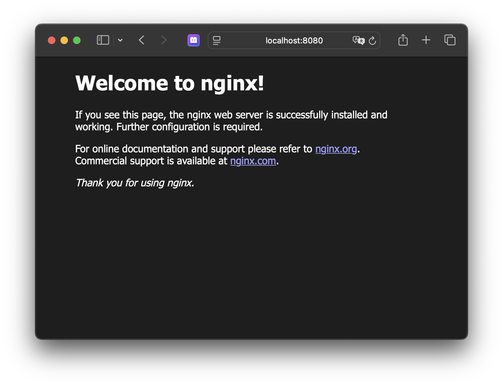

# Host your own secure website

If you want to host a website from the comfort of your own home, this recipe is for you.
Please bear in mind that it's not tailor-made, so some web searching and reading manuals
may be required in addition to what is written here.

## Prerequisites

* Internet access with fixed IP address
* A domain name that you like
* Access to your router configuration
* Docker and the NGINX image
* Some HTML content

## Internet Access

Since you're looking at this repository, the assumption is that you have access
to the world wide web. That also means that your computer is handed an IP address.
To find out which one, just open yet another tab on your browser and go to https://whatsmyip.org or access your router if you know where to look.

Now most internet service providers (ISP's) offer a fixed IP address on your subscription,
and that's what you want. But it might be the case that [DHCP](https://en.wikipedia.org/wiki/Dynamic_Host_Configuration_Protocol) 
throws a spanner in the works and gives you a different IP address from time to time.
So then the alternative is to use [Dynamic DNS](https://en.wikipedia.org/wiki/Dynamic_DNS).

## Domain Name

Once you've jot down the address, it's time to shop for a domain (if you haven't already done so).
Just type 'getting a domain name' in your favourite search engine and look for a nice offer or a 
party that you find trustworthy.

Hopefully your wanted domain is not yet taken. Note that shorter names and popular extensions 
([TLD's](https://en.wikipedia.org/wiki/Top-level_domain)) might raise the price.

Also make sure that, before you buy a domain, the reseller and/or registrar offer the possibility
of managing your [DNS](https://en.wikipedia.org/wiki/Domain_Name_System) settings.

There are a lot of options to configure. However the most important one is the so-called
[A record](https://en.wikipedia.org/wiki/List_of_DNS_record_types). Create or change this 
entry and put in your personal IP address.

## Router Configuration

After configuring that A record, the synchronisation process takes place, making that domain
name configuration change known world wide, so accessing it will end up at your doorstep, 
i.e. your router.

Assuming your router is unable to act as a web server, chances are that you have a computer
in your network that can. For the sake of this recipe, that particular computer needs to have 
[Docker](https://docker.com) installed and it should have a fixed IP address. There are several 
ways to obtain that depending on your operating system. Generally commanding a terminal/shell 
and issuing `ipconfig` on Windows or `ifconfig` on Mac/Linux will show it to you.

To fixate that particular address, look at the manual of your router, in particular the section
that talks about **Static DHCP leases**.

Once you have that address that same router needs to deal with network address translation
or [NAT](https://en.wikipedia.org/wiki/Network_address_translation) for short. This is also
known as **port forwarding**. You specify a port (80 and 443 for HTTP(S) traffic) and a
target IP address, that being the one from your computer that is going to be the web server.

## Web Server

The flavour of the week for running a web server is [NGINX](https://www.f5.com/go/product/welcome-to-nginx). Of course it's possible to install the software directly onto the designated
computer, but another option is to use Docker. To (install and) run it, just type

```shell
docker run -it --rm -p 8080:80 --name web nginx
```

Open your browser and go to URL http://localhost:8080



Press Control-C to stop the web server.

Of course this is happening all locally and is not secure. To add [TLS](https://en.wikipedia.org/wiki/Transport_Layer_Security) to your server, a certificate is needed. These can be obtained
(a.o.) at [Let's Encrypt](https://letsencrypt.org). Installing this can be cumbersome and the certificates are only valid for three months. Wouldn't it be nice to have the configuration and
renewal automated? Well, you're in luck. The [nginx-proxy](https://github.com/nginx-proxy/nginx-proxy) with the [acme-companion](https://github.com/nginx-proxy/acme-companion) can do that
for you.

You'll need a folder structure

```
.
├── config
│   ├── certs
│   │   ├── my-website.com
│   ├── conf.d
│   ├── templates
│   └── vhost.d
└── sites
    ├── my-website
    └── proxy
```

## Content

## TODO

* Check image versions used and upgrade