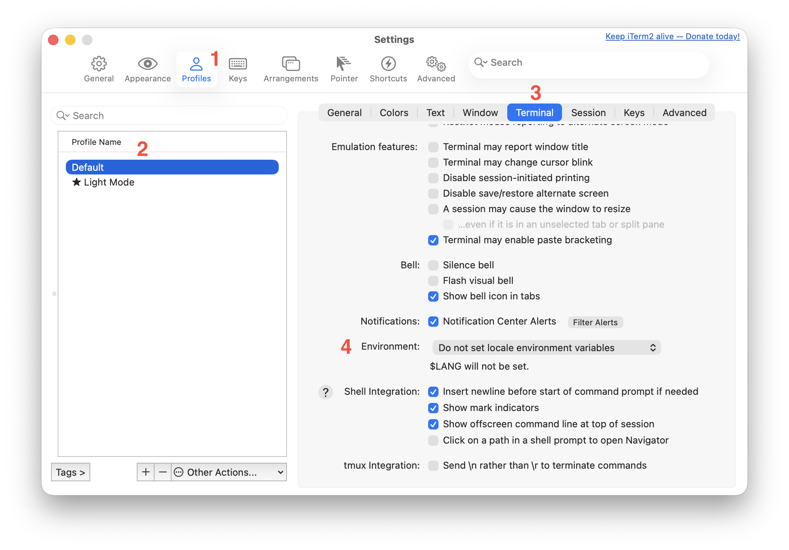
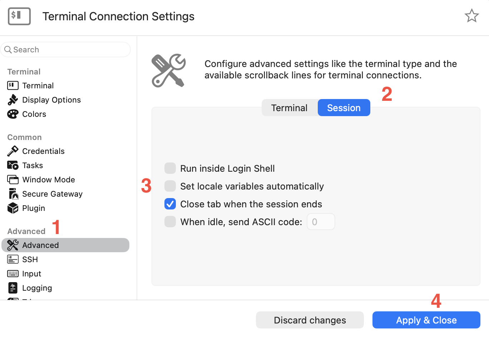

# -bash: warning: setlocale: LC_CTYPE: cannot change locale (UTF-8): No such file or directory

This warning may appear when you log in to a Debian Linux machine and below are a few places to look for one or more solutions. And it targets MacOS clients. It might work on other systems as well, but YMMV.

## Reference

https://wiki.debian.org/Locale

## Terminals

When opening a command line terminal and after logging in, this warning might be shown. so it makes sense to look here first. Find the setting about locale variables and make sure it is unchecked/disabled.

### Terminal

Open the Terminal app and go to settings (⌘,)

1. Select Profiles
2. Select Theme
3. Select Advanced tab
4. Uncheck 'Set local variables on startup'


### iTerm

Open the iTerm app and go to settings (⌘ ,)

1. Select Profiles
2. Select Theme
3. Select Terminal tab
4. Scroll down and under Environment select 'Do not set locale environment variables' from the pulldown menu



### Royal TSX

Open Royal TSX, select the Terminal Connection and open Properties (via Actions menu, right click or ⌘ i)

1. Select Advanced
2. Select Session
3. Uncheck 'Set locale variables automatically'
4. Click Apply & Close



## Debian (Trixie)

Locale settings on Debian systems are all over the place. Some are deprecated, but may still exist after a systems upgrade.

Check the installed locales

```shell
locale -a
```

Generate the ones that are missing

```shell
sudo dpkg-reconfigure locales
```

and check

```shell
sudo vi /etc/default/locale
sudo vi /etc/locale.conf
```

Check the SSH server settings

```shell
sudo vi /etc/ssh/sshd_config
```

and look for

```
# Allow client to pass locale and color environment variables
AcceptEnv LANG LC_* COLORTERM NO_COLOR
```

Settings from previous versions may still exist

```shell
sudo vi /etc/environment
```

which you can remove

```shell
sudo rm /etc/environment
```

Maybe some other settings may need changing. Just look at the Debian Wiki (follow the link shown above)

## Alternative

When you still want the SSH client to be in control, forget about the settings above and use this:

```shell
vi ~/.ssh/config
```

and add

```
Host *
  SetEnv LC_ALL=en_GB.utf8 LC_CTYPE=en_GB.utf8
```

Of course, set the name of your favourite locale or the one mentioned in the warning.
