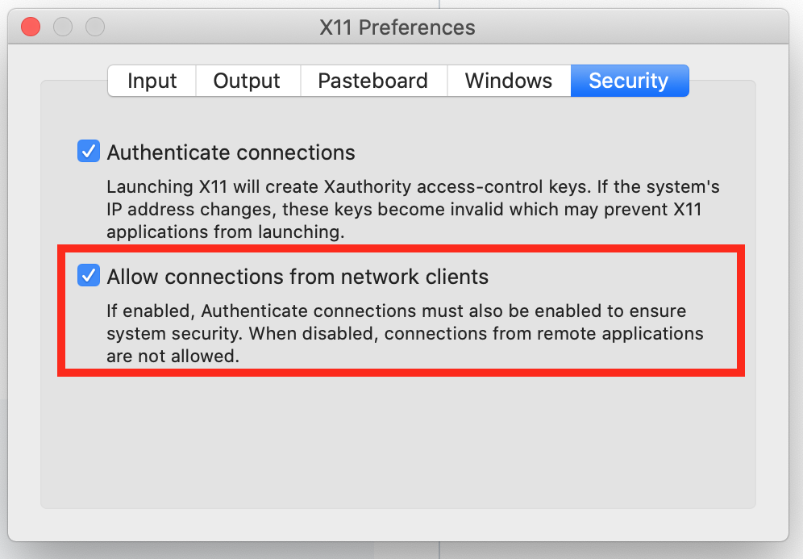

# X11 on Mac OS

In order to run Unix/Linux graphical user interfaces the X Window System is often used (X11 or X for short) : https://en.wikipedia.org/wiki/X_Window_System

XQuartz is an X11 implementation that runs on Mac OS. The documentation is based on this [article](https://towardsdatascience.com/empowering-docker-using-tkinter-gui-bf076d9e4974) and [gist](https://gist.github.com/paul-krohn/e45f96181b1cf5e536325d1bdee6c949).

## Installation

1. Install XQuartz (https://www.xquartz.org/).
2. Launch XQuartz.
3. Under the XQuartz menu, select Preferences.
4. Go to the security tab and ensure "Allow connections from network clients" is checked.
   
5. Reboot.
6. Test with `/usr/X11/bin/xeyes`.

## To forward X11 from inside a docker container to a host running macOS

1. Run `xhost + $(hostname)` to allow connections to the macOS host and you'll see a message like _Your-MacBook-Pro.local being added to access control list_.
2. Run Docker with the `--env DISPLAY=host.docker.internal:0` as one of the arguments.
3. The `--volume /tmp/.X11-unix:/tmp/.X11-unix` is often used, but it doesn't seem necessary.

## Sample Dockerfile

A great way to demo these GUI capabilities is to use Python's `tkinter` library.

```Dockerfile
FROM python:3.11.6-slim
RUN apt-get update -y
# Install Tkinter
RUN apt-get install tk -y
# Commands to run Tkinter application
CMD ["run_this.py"]
ENTRYPOINT ["python3"]
```

Run `docker build --tag python-gui --file Dockerfile .` to build the image.

Mount this Python file when running the container:

```Python
import tkinter as tk

# Tkinter Window
root_window = tk.Tk()

# Window Settings
root_window.title('Application Title')
root_window.geometry('300x100')
root_window.configure(background = '#353535')

# Text
tk.Label(root_window, text='Hello World', fg='White', bg='#353535').pack()

# Exit Button
tk.Button(root_window, text='Exit', width=10, command=root_window.destroy).pack()

# Main loop
root_window.mainloop()
```

Run the container:

```shell
DISPLAY=host.docker.internal:0

docker run --rm --user $(id -u $USER):$(id -g $USER) \
           --env DISPLAY=$DISPLAY \
           --volume ./tkinter_test.py:/run_this.py
           python-gui
```

And it works with Turtle Graphics too!

```Python
import turtle
import random


def star():
    for i in range(5):
        t.fd(10)
        t.right(144)


s = turtle.getscreen()
t = turtle.Turtle()
s.bgcolor("black")
t.color("white")
s.title("Starry Starry Night")
t.speed(0)
t.hideturtle()
t.up()
t.goto(0, 170)
t.down()
t.begin_fill()
t.circle(80)
t.end_fill()
for i in range(100):
    x = random.randint(-640, 640)
    y = random.randint(-330, 330)
    t.up()
    t.goto(x, y)
    t.down()
    star()
```

```shell
DISPLAY=host.docker.internal:0

docker run --rm --user $(id -u $USER):$(id -g $USER) \
           --env DISPLAY=$DISPLAY \
           --volume ./starry_starry_night.py:/run_this.py
           python-gui
```
